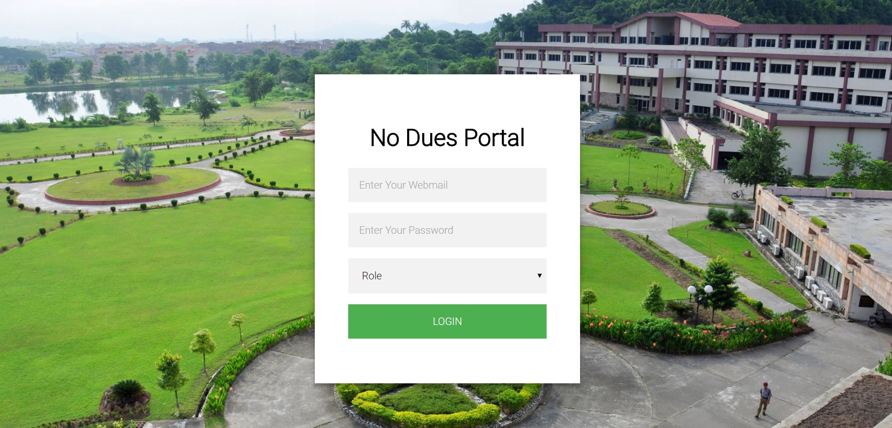
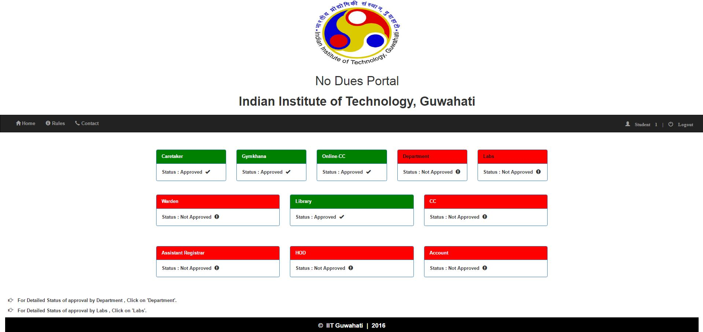
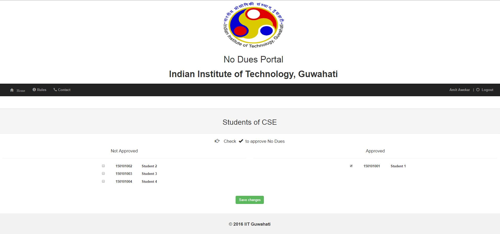

# No Dues Automation Portal

Clone the repository using git clone https://github.com/piyush-jain1/NoDuesPortal

This is a quick guide on how to use this system.

**Starting the Server** : Open your Terminal ( Power Shell in Windows ) , change the directory to the directory in which your project is present. Run the commmand : `python manage.py runserver`

Go to your browser and visit : `127.0.0.1:8000/login_user` or `localhost:8000/login_user`
You can check the dummy credentials already created by logging into admin panel and clicking on 'Users'. Or you may also create new users.

**Login Page** : User needs to give the Webmail ID, password and select his/her role (e.g. Student, faculty, lab, library, gymkhana, CC, HOD, etc.). on clicking on LOGIN button, you will be redirected to your respective profile.

**Student Profile** : You can see your current status of No Dues Clearance from different sources on your home page. 
'Green' coloured box represents that No Dues has been cleared, 'Red' represents not.
For detailed information about clearance from Department Faculty and Labs, you may click on 'Department' and 'Lab' respectively.
It will show a list with red(uncleared)-green(cleared) formatting.

**Faculty and Other roles**  : After you are redirected to your respective profiles, you will get to see two different lists. 
On the left side, there is a list on students whom you haven't give No Dues Clearance and the one on the right are those who have been given clearance.
You can change both the lists at any time.

**Features** :
* The login authentication system has all error handling features, like for wrong credentials, it will prompt the user. Also, if you give wrong role,you will be prompted for the same.
* We have tried to resemble the UI of the system as per the websites of IIT Guwahati.
* The system follows complete heirarchy law. It means that it follows the constraints like Warden can't give clearance until caretaker has not given the clearance to a particular student, similarly HOD can't give clearance until all the faculties of the department have not given the clearance.
* The system also ensures reverse heirarchy, like , for exapmle, a student has got clearance from caretaker and then the warden, but after that, the caretaker changes his take and marks him dues, then it will automatically mark him 'Due' for all above his heirarchy(like warden).

NOTE : 
* All dummy passwords have been initialized as : `csepassword`
* Access to admin panel :  Username : `admin`

                           
